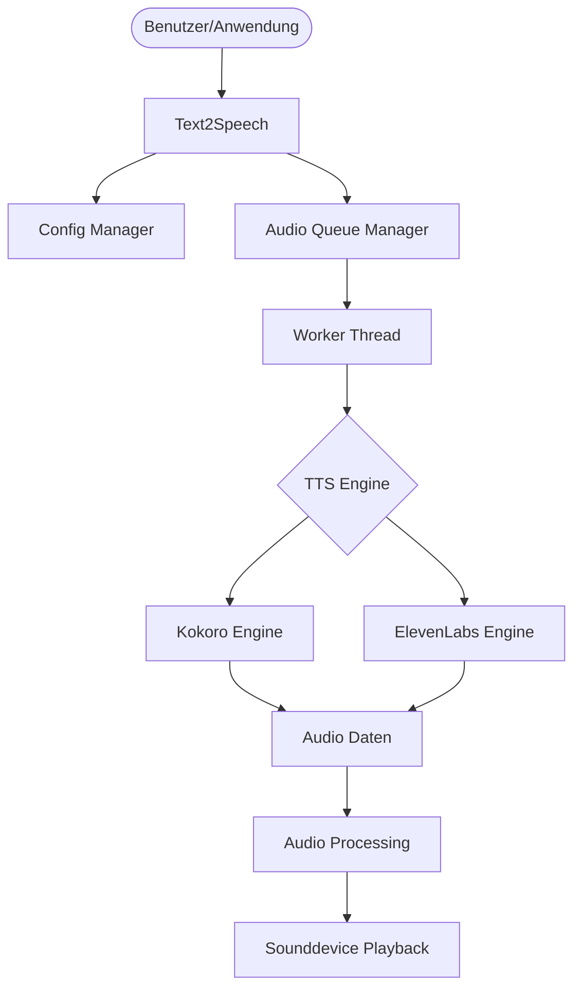
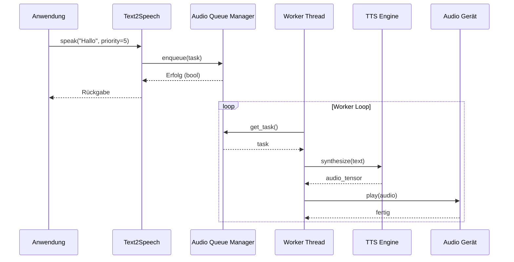

# Architektur

Diese Seite beschreibt die interne Architektur von `text2speech`.

## Systemübersicht

Das System ist in mehrere Komponenten unterteilt, die zusammenarbeiten, um Text in Sprache umzuwandeln und diese sicher abzuspielen.

## Datenfluss

Der Datenfluss folgt einer klaren Pipeline, um eine blockierungsfreie Verarbeitung zu ermöglichen.

## Komponentendetails

### Text2Speech
Die Haupt-Einstiegsklasse. Sie koordiniert die Initialisierung der Engines, lädt die Konfiguration und stellt die öffentliche API bereit.

### AudioQueueManager
Ein thread-sicherer Manager, der eine Prioritätswarteschlange verwendet. Er stellt sicher, dass Audio-Anfragen nacheinander verarbeitet werden, was besonders wichtig ist, um Hardware-Konflikte bei ALSA oder PortAudio zu vermeiden.

### TTS Engines
Wir unterstützen zwei Haupt-Backends:
1. **Kokoro Engine**: Lokal ausgeführtes, hocheffizientes Modell (82M Parameter).
2. **ElevenLabs Engine**: Cloud-basiertes Backend für High-End-Sprachsynthese (Legacy-Support).

### Audio Processing
Bevor die Audiodaten an die Hardware gesendet werden, durchlaufen sie eine Verarbeitungskette:
- **Resampling**: Anpassung an die vom Gerät unterstützte Abtastrate.
- **Normalisierung**: Anpassung der Lautstärke.
- **Clamping**: Verhindern von Übersteuerungen.
