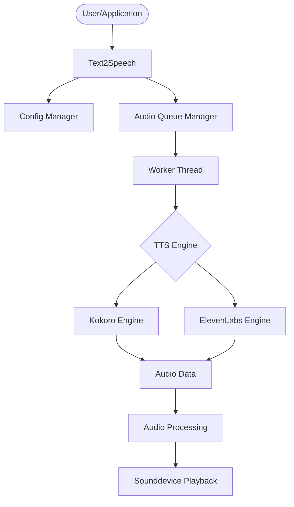
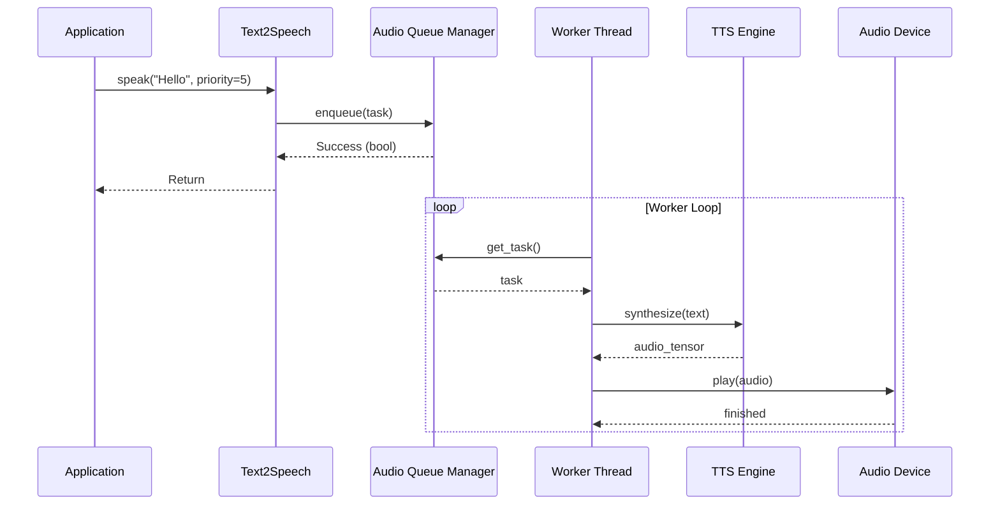

# Architecture

This page describes the internal architecture of `text2speech`.

## System Overview

The system is divided into several components that work together to convert text to speech and play it safely.

## Data Flow

The data flow follows a clear pipeline to enable non-blocking processing.

## Component Details

### Text2Speech
The main entry point class. It coordinates the initialization of engines, loads the configuration, and provides the public API.

### AudioQueueManager
A thread-safe manager that uses a priority queue. It ensures that audio requests are processed sequentially, which is particularly important for avoiding hardware conflicts with ALSA or PortAudio.

### TTS Engines
We support two main backends:
1. **Kokoro Engine**: Locally executed, highly efficient model (82M parameters).
2. **ElevenLabs Engine**: Cloud-based backend for high-end speech synthesis (legacy support).

### Audio Processing
Before the audio data is sent to the hardware, it passes through a processing chain:
- **Resampling**: Adjustment to the sample rate supported by the device.
- **Normalization**: Adjustment of the volume.
- **Clamping**: Prevention of clipping.
