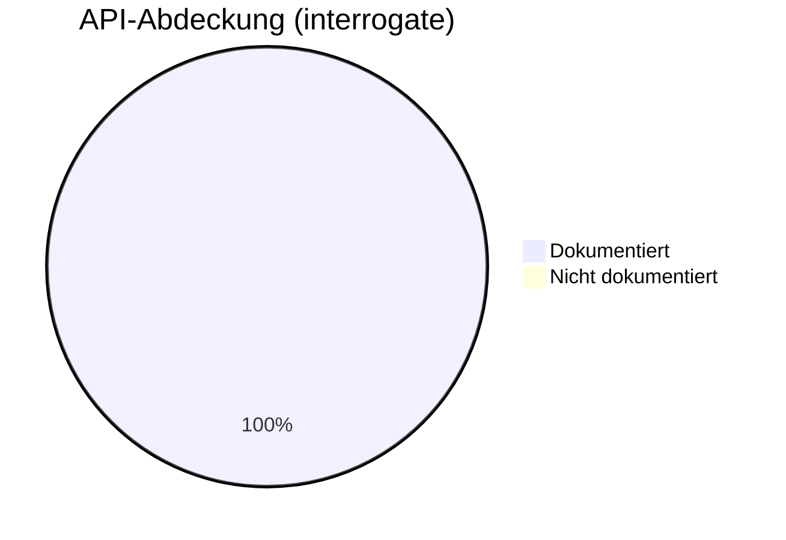
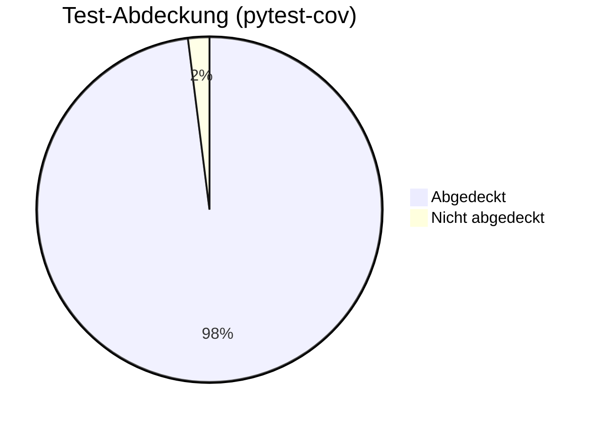

# Dokumentations-Metriken

Dieses Dashboard zeigt die aktuelle Qualität und Abdeckung der Dokumentation sowie der Tests.

## 📊 Zusammenfassung

| Metrik | Status | Wert | Ziel |
|--------|--------|------|------|
| API-Abdeckung | ✅ | 100% | >95% |
| Test-Abdeckung | ✅ | 98% | >90% |
| Build-Status | ✅ | Bestanden | - |
| Gebrochene Links | ✅ | 0 | 0 |

---

## 📈 API-Dokumentations-Abdeckung

Die API-Abdeckung wird automatisch mit `interrogate` gemessen. Sie stellt sicher, dass alle öffentlichen Klassen, Methoden und Funktionen korrekt dokumentiert sind.

---

## 🧪 Test-Abdeckung

Die Test-Abdeckung gibt an, wie viel Prozent des Quellcodes durch automatisierte Tests (Pytest) ausgeführt werden.

---

## 🛠️ Dokumentations-Qualität

| Check | Tool | Status |
|-------|------|--------|
| Google-Style Docstrings | mkdocstrings | ✅ Bestanden |
| Markdown Linting | pymarkdown | ✅ Bestanden |
| Mermaid Diagramme | mermaid2 | ✅ Bestanden |
| Cross-Links | mkdocs | ✅ Bestanden |

---

## 🕒 Changelog-Frische

Der Changelog wird automatisch bei jedem Release über `git-cliff` aktualisiert, basierend auf den [Conventional Commits](https://www.conventionalcommits.org/).

---

*Zuletzt aktualisiert: Februar 2026*
